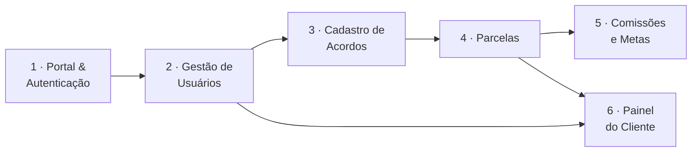

# Advocondo — Documentação do Projeto

Documentação de requisitos do **sistema de gestão de acordos extrajudiciais** desenvolvido para um escritório de advocacia que atua na recuperação de crédito de condomínios.

Esta documentação é a fonte única dos requisitos acordados com o cliente. Ela é versionada junto com o código, no repositório [Advocondo/docs](https://github.com/Advocondo/docs), e publicada automaticamente a cada alteração na branch `main`.

---

## O problema

O escritório negocia acordos de pagamento com moradores inadimplentes de condomínios que representa. Cada acordo tem um valor total, uma fatia de honorários do escritório, um parcelamento negociado e um advogado responsável — e precisa ser acompanhado mês a mês até a quitação. Hoje esse acompanhamento e a prestação de contas ao síndico dependem de controle manual e de contato direto com o escritório.

O sistema cobre esse ciclo de ponta a ponta: cadastro do acordo, acompanhamento das parcelas, apuração de comissões e metas da equipe, e um painel de consulta para o próprio condomínio.

---

## Perfis de acesso

| Perfil | Quem é | O que enxerga |
| --- | --- | --- |
| **Visitante** | Qualquer pessoa que acessa a URL | Apenas a landing page institucional ([US01](historias/ep01-portal-autenticacao.md#us01)) |
| **Administrador** | Sócio/gestor do escritório | Tudo: gestão de usuários, faturamento global, comissões da equipe, logs e conteúdo institucional |
| **Equipe Operacional** | Colaboradores do escritório | Cadastro e operação de acordos e parcelas; apenas as **próprias** metas e comissões |
| **Cliente** | Síndico ou administradora do condomínio | Apenas acordos dos condomínios aos quais está vinculado, em visão simplificada e sem dados financeiros do escritório |

!!! note "Marcação de advogado"
    Ser advogado (com número da OAB) é uma **marcação independente do nível de acesso**, feita no cadastro do usuário ([US07](historias/ep02-usuarios-perfis.md#us07)). Ela define quem pode ser escolhido como responsável por um acordo ([US18](historias/ep03-cadastro-acordos.md#us18)).

---

## Mapa da documentação

| Seção | O que você encontra |
| --- | --- |
| **[Histórias de usuário](historias/index.md)** | As 40 histórias acordadas com o cliente, organizadas em 6 épicos, com critérios de aceitação identificados individualmente. |
| **[Matriz de rastreabilidade](rastreabilidade/matriz.md)** | Quem depende de quem, cobertura por perfil e mapa de dependências entre histórias. |

---

## Os seis épicos

| # | Épico | Histórias | Foco |
| --- | --- | --- | --- |
| 1 | [Portal Institucional & Autenticação](historias/ep01-portal-autenticacao.md) | US01–US06 | Vitrine pública e controle de acesso |
| 2 | [Gestão de Usuários e Perfis](historias/ep02-usuarios-perfis.md) | US07–US11 | Quem entra, com quais permissões |
| 3 | [Cadastro de Acordos](historias/ep03-cadastro-acordos.md) | US12–US24 | Estrutura do acordo: valores, parcelas, responsável |
| 4 | [Acompanhamento de Parcelas](historias/ep04-parcelas.md) | US25–US31 | Rotina mensal de baixa e inadimplência |
| 5 | [Comissões e Metas](historias/ep05-comissoes-metas.md) | US32–US36 | Desempenho da equipe e visão financeira |
| 6 | [Painel do Cliente](historias/ep06-painel-cliente.md) | US37–US40 | Autonomia do síndico/administradora |

---

## Como esta documentação evolui

- Cada alteração é feita via commit no repositório `docs` e publicada automaticamente pelo GitHub Actions.
- Identificadores de história (`US01`) e de critério (`US01-CA01`) são **estáveis**: não são renumerados quando algo é inserido ou removido.
- As convenções completas de escrita e identificação estão em [Histórias de usuário → convenções](historias/index.md#convencoes).
